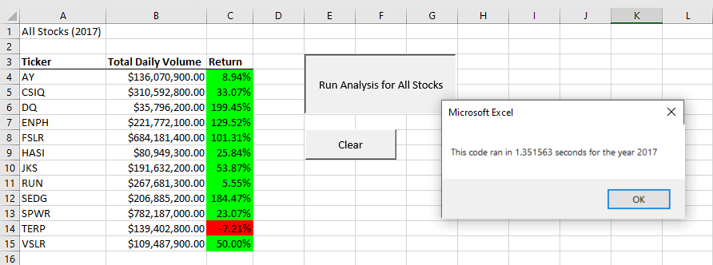
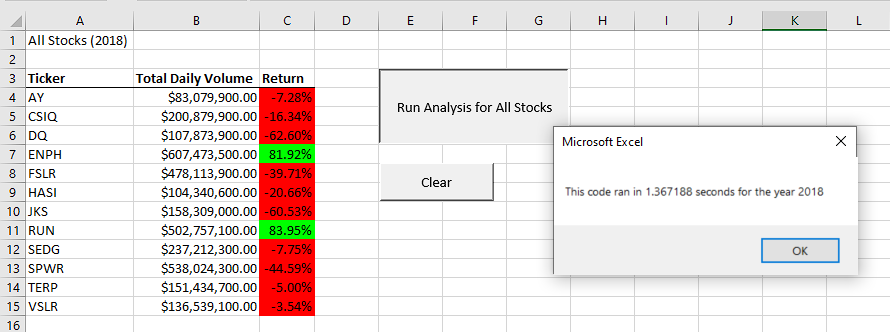
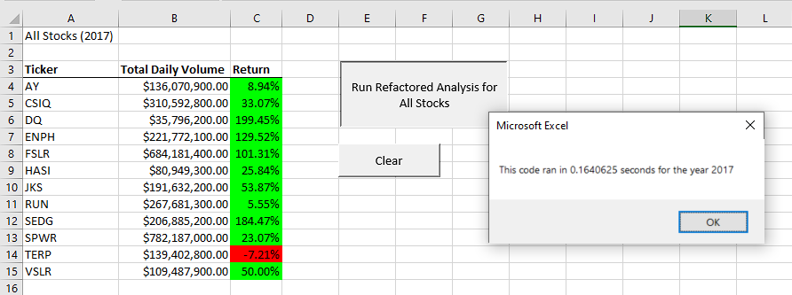
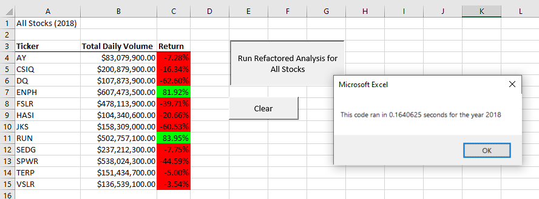

# stock-analysis

## Overview
Visual Basic script "yearValueAnalysis.vbs" was created to analyze performance of 12 Green energy stocks in 2017 and 2018. The original script was refactored in order to decrease the time it took to complete the macro with the intention of, eventually, applying this to a much greater number of stocks.

## yearValueAnalysis breakdown
The dataset was presorted with stock tickers in alphabetical order with each stock sorted again in increasing chronological order. We first set the stage for the analysis of the stocks by: 
1. initializing several variables like yearValue, startTime, endTime, RowCount, 
2. formatting the worksheet with the desired column headers for output,
3. initializing tickers() array to hold stock tickers.
4. starting the timer

Then `yearValueAnalysis` script reads and stores total daily volume, starting and ending price into variables by using a nested For loop. The first `For` loop cycles through each ticker as iterator `i` increments. The outer loop  the ticker string and initializes the `totalVolume` to zero every time before stepping into the inner `For` loop.
```
Sub yearValueAnalysis()

Dim startTime As Single
Dim endTime As Single

yearValue = InputBox("What year would you like to run the analysis on?")

'inserted Timer function here to start after inputbox for year
    startTime = Timer

'Format output sheet on All Stocks Analysis worksheet
    Worksheets("All Stocks Analysis").Activate
    Cells(1, 1).Value = "All Stocks (" + yearValue + ")"
    Cells(3, 1).Value = "Ticker"
    Cells(3, 2).Value = "Total Daily Volume"
    Cells(3, 3).Value = "Return"

'Create array with 12 elements, i.e. all tickers
    Dim tickers(11) As String
        tickers(0) = "AY"
        tickers(1) = "CSIQ"
        tickers(2) = "DQ"
        tickers(3) = "ENPH"
        tickers(4) = "FSLR"
        tickers(5) = "HASI"
        tickers(6) = "JKS"
        tickers(7) = "RUN"
        tickers(8) = "SEDG"
        tickers(9) = "SPWR"
        tickers(10) = "TERP"
        tickers(11) = "VSLR"
    

'Prepare analysis of tickers
    'Initialize variables for starting price and ending price
        Dim startingPrice As Single
        Dim endingPrice As Single
    'Activate data worksheet
        Worksheets(yearValue).Activate
    'Find number of rows to loop over
        RowCount = Cells(Rows.Count, "A").End(xlUp).Row


'Loop through the tickers, every increment of i cycles through each ticker
    For i = 0 To 11
    Ticker = tickers(i)
    'To reset totalVolume to zero before moving into the next ticker
        totalVolume = 0
```

The inner `For` loop uses iterator `j` to loop through all rows (all 3013 of them!) and interrogates each row with several If statements to determine the values for total volume, starting price and ending price and store them into variables. The For (j) loop concludes and the data for the current ticker is listed by calling the variables before `i` increments by 1 onto the next ticker. It is important to note here that this method fulfills the If statement by comparing the current column A string with `Ticker = Tickers(i)`.

```
'Loop through rows in data, from 2 to last row_index
            Worksheets(yearValue).Activate
            For j = 2 To RowCount
                'Find total volume for current ticker, compares each string in column A to current Ticker string and adds volume iteratively as long as current ticker matches ticker(i)
                    If Cells(j, 1).Value = Ticker Then
                    totalVolume = totalVolume + Cells(j, 8).Value
                    End If
                'Find starting price for current ticker, similarly, if column A ticker matches ticker(i) and the previous row is not ticker(i) then store closing price in startingPrice
                    If Cells(j, 1).Value = Ticker And Cells(j - 1, 1).Value <> Ticker Then
                    startingPrice = Cells(j, 6).Value
                    End If
                'Find ending price for current ticker, as above.
                    If Cells(j, 1).Value = Ticker And Cells(j + 1, 1).Value <> Ticker Then
                    endingPrice = Cells(j, 6).Value
                    End If
            Next j
    
    'Output data for current ticker
        Worksheets("All Stocks Analysis").Activate
        Cells(4 + i, 1).Value = Ticker
        Cells(4 + i, 2).Value = totalVolume
        Cells(4 + i, 3).Value = (endingPrice / startingPrice) - 1
    Next i

'Formatting
    Worksheets("All Stocks Analysis").Activate
    Range("A3:C3").Font.Bold = True
    Range("A3:C3").Borders(xlEdgeBottom).LineStyle = xlContinuous
    Range("B4:B15").NumberFormat = "$#,##0.00"
    Range("C4:C15").NumberFormat = "0.00%" 'two digits of precision
    Columns("A").AutoFit
    Columns("B").AutoFit
    Columns("C").AutoFit
    
    dataRowStart = 4
    dataRowEnd = 15
    
    For i = dataRowStart To dataRowEnd
        If Cells(i, 3) > 0 Then
            Cells(i, 3).Interior.Color = vbGreen
        ElseIf Cells(i, 3) < 0 Then
            Cells(i, 3).Interior.Color = vbRed
        Else
            'if none of the above is met then clear the cell color
            Cells(i, 3).Interior.Color = xlNone
        End If
    Next i
    
    endTime = Timer
    MsgBox "This code ran in " & (endTime - startTime) & " seconds for the year " & (yearValue)


End Sub
```

The outer loop exits and the script edits cells in column B for some visual feedback and number formatting. Finally, a `msgBox` prints the amount of time it took to run the macro. 

<details>
    <summary> Results of original script </summary>
    
    
</details>

<details>
    <summary> Results of refactored script </summary>
    
    
</details>

## How did other Green energy stocks fare?
Based on the output of the script, Steve's watchlist of green energy stocks in general grew better in 2017 than in 2018. This is consistent with events of the time, especially considering the volatile market performance in 2018 and the steady market decline starting in October 2018. 

## Refactoring strategy for yearValueAnalysis
In order to optimize the script run-time, the refactored code addressed a few features of the original script.

In `yearValueAnalysis` the nested `For` loop is the biggest bottleneck to a quicker run-time. Specifically, the inner loop of If statements is run `12 tickers * 3012 rows` for a total of 36,144 times. If we loop through all rows once only, this will require a different strategy to store data into those output variables (`totalVolume`, `startingPrices` and `endingPrices`) and it would require a more dynamic way of indexing every unique ticker. Introducing, power duo variable `tickerIndex` and arrays. See below for the pseudocode.

1. Retain the same until the line determining number of rows to loop over 
2. Create variable `tickerIndex` and initialize it to 0
3. Create three output arrays to store data from each ticker: total volumes, ticker starting prices and ticker ending prices
4. Create a `For` loop to initialize `tickerVolumes` to 0
5. Create another `For` loop to loop over all rows in the spreadsheet. For every increment of `i`, interrogate the Ticker column with decision statements similar to the original script to determine ticker volumes, starting and ending prices except using tickerIndex. This allows the use of `i` to iterate over rows, while `tickerIndex` is used to store values into the output arrays and participate in decision statements. Because we want to loop through the worksheet only once, we also need `tickerIndex` to increase before the next ticker (i.e. before `i` increments), therefore the additional line to increase `tickerIndex` by 1 if the cell in the first column matches `tickers(tickerIndex)` and if the next row does not match `tickers(tickerIndex)`. This means `tickerIndex` increases 12 times in one loop, storing data for each unique ticker. 
```
For i = 2 To RowCount
    tickerVolumes(tickerIndex) = tickerVolumes(tickerIndex) + Cells(i, 8).Value        
    
    If Cells(i, 1).Value = tickers(tickerIndex) And Cells(i - 1, 1).Value <> tickers(tickerIndex) Then
        tickerStartingPrices(tickerIndex) = Cells(i, 6).Value
    End If

    If Cells(i, 1).Value = tickers(tickerIndex) And Cells(i + 1, 1).Value <> tickers(tickerIndex) Then
        tickerEndingPrices(tickerIndex) = Cells(i, 6).Value
        tickerIndex = tickerIndex + 1
    End If
Next i
```
6. Activate the output worksheet and create another loop to print values stored in the output arrays as `tickerIndex` increases. 

By choosing to loop through the spreadsheet only once, refactoring has also decreased script run-time by
1. avoiding excessive `worksheets().activate` per loop (original script switches worksheets 24 times!) 
2. using variables (arrays in this case) to store data. Recalling stored data from memory is faster than activating worksheets, looping then printing. 

# Why refactor at all? 
First attempts at scripting/coding are often inefficient. Refactoring is an opportunity to achieve faster run-times, simpler logic-flow, more robust/stable code, fixing code smells, improving readability. These are a few reasons to consider refactoring code. As with this refactor attempt, script run-time was decimated while it was able to return the same output as the original script. 

However, a valid question to ask could be: was the refactoring time worth it? The original code took less than 2 seconds for completion, which is hardly a hindrance. While the argument could hold true for much larger code with much longer run-times, it is perhaps not worth it for cases like this. Especially in the context of production with existing deadlines, there is a huge opportunity cost to refactoring. Time taken to plan, write, test and re-write refactored code is time not spent on other priorities.  
